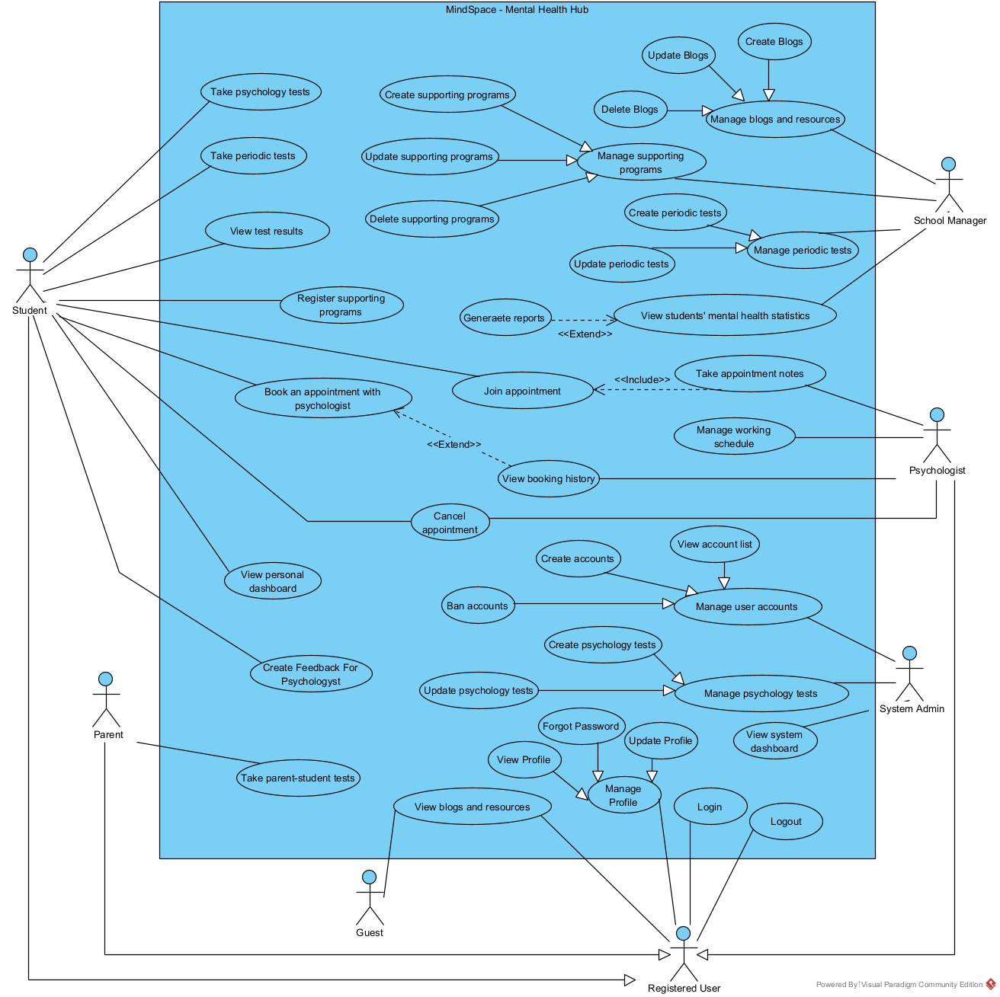
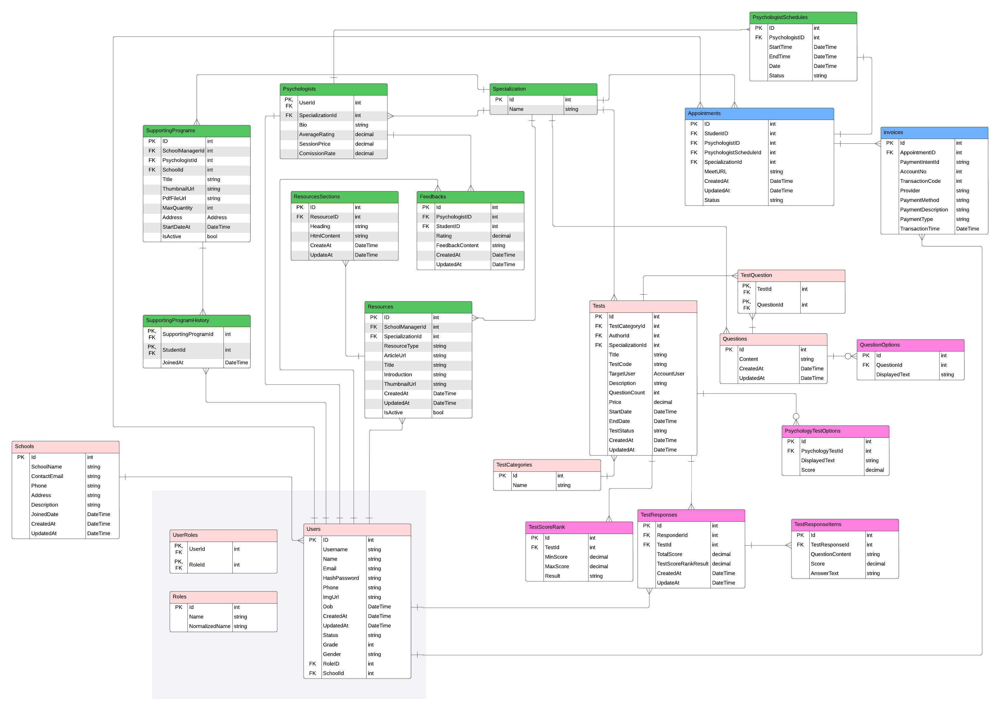
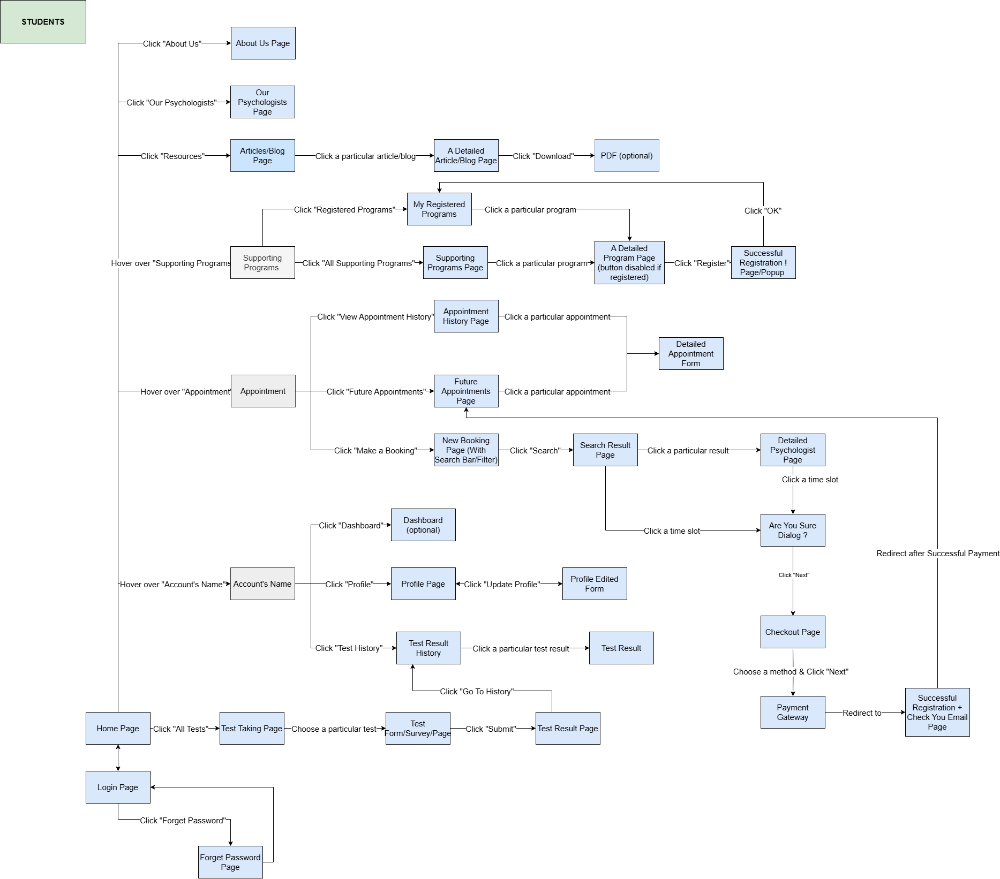
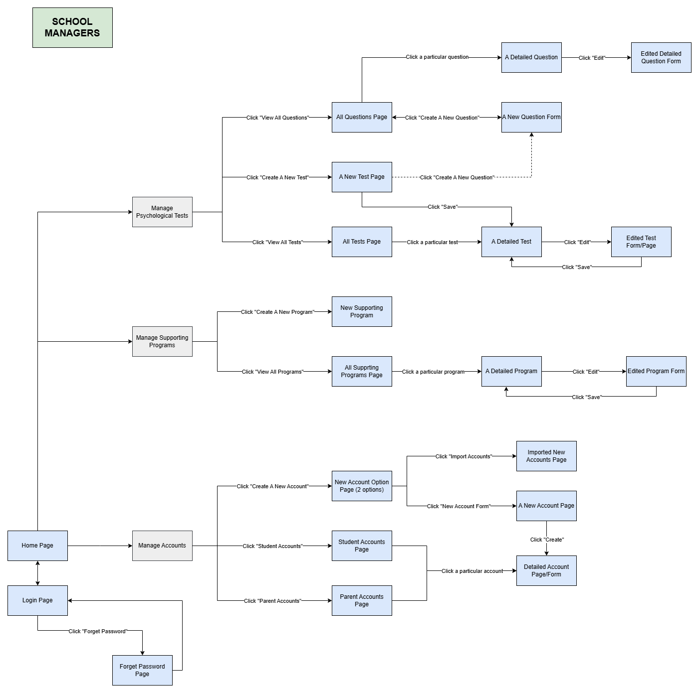
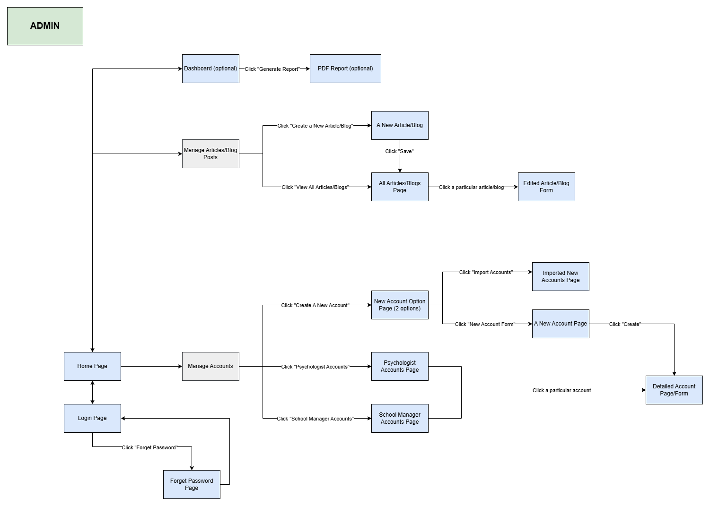

# MindSpace - School Mental Health Management System
<div align="center">
    
    <p>MindSpace is a web application that provides mental health services for high school students and parents.</p>
</div>
<div align='center'>
 
 
 
 
 

<br>
</div>

## Table of Contents
<ol start="0"> 
    <li><a href="#intro">Introduction</a></li>
    <li><a href="#tech">Tech Stacks</a></li>
    <li><a href="#install">Installation</a></li>
    <li><a href="#api-docs">API Documentation</a></li>
    <li><a href="#uc-diagram">Use Case Diagram</a></li>
    <li><a href="#uc-diagram">Architecture Diagram</a></li>
    <li><a href="#db-design">Database Design</a></li>
    <li><a href="#screen-flow"> Screen Flow</a></li>
    <li><a href="#team-members">Team Members</a></li>
    <li>
        <a href="#app-a">Appendix A</a>
    </li>
</ol>


<a id="intro"></a>
## 0. Introduction
The increasing concern for students' mental health in Vietnamese schools highlights the need for a structured psychological support system. 
Currently, many schools lack a standardized approach to managing students' well-being. 
MindSpace aims to bridge this gap by providing a digital platform where students can access professional counseling services, schools can monitor overall student mental health trends, and psychologists can offer their expertise.

## Core Features

- **Psychological Assessments**: Students can take structured psychological tests to evaluate their mental health.
- **Supporting Programs**: Schools provide students with three free Supporting Programs through workshops and webinars for specific targets (e.g., school mental health, anxiety, etc.), featuring professional psychologists.
- **Appointment Scheduling**: Students can book sessions with licensed psychologists directly through the platform.
- **Confidential Chat System**: Secure messaging between students and an AI chatbot for follow-up support.
- **Mental Health Resources**: A curated library of self-help materials, articles, and exercises for students.
- **Administrative Dashboard for Schools**: Schools can monitor student participation and access general mental health trends (without violating privacy).
- **Psychologist Management System**: Tools for psychologists to manage their schedules, session notes, and earnings.

## Target Users

- **Primary Users**:
  - School managers
  - Students
  - Psychologists
- **Secondary Users**:
  - Parents


<a id="tech"></a>
## 1. Tech Stacks

<details>
  <summary>Client</summary>
  <ul>
    <li>Typescript</li>
    <li>Next JS</li>
    <li>Hero UI</li>
    <li>Tailwind CSS</li>
    <li>Axios</li>
  </ul>
</details>

<details>
  <summary>Server</summary>
  <ul>
    <li>ASP .NET Core API</li>
    <li>Entity Framework</li>
    <li>ASP .NET Identity</li>
    <li>JWT</li>
    <li>Swagger OpenAPI</li>
    <li>ASP .NET SignalR</li>
    <li>Mediator</li>
  </ul>
</details>

<details>
<summary>Database</summary>
  <ul>
    <li>Microsoft SQL Server</li>
    <li>Redis</li>
  </ul>
</details>

<details>
<summary>API Deployment</summary>
  <ul>
    <li>Docker</li>
    <li>Microsoft Azure Cloud Services</li>
    <li>Github Actions</li>
  </ul>
</details>

<details>
<summary>Others</summary>
  <ul>
    <li>Gemini API</li>
    <li>Stripe API</li>
    <li>WebRTC</li>
    <li>Cloudinary File Storage</li>
  </ul>
</details>

<a id="install"></a>
## 2. Installation
To get a local copy of the project up and running, follow these steps.

### Prerequisites
- .NET Core 9.0
- SQL Server
- Redis

Clone the repository:

```bash
git clone https://github.com/SWD-MindSpace/MindSpace_BE.git

cd MindSpace_BE
```

Configure the database
```
Add appsettings.json to resources
```

Build the project
```
dotnet build
```

Run the application
```
dotnet run
```
The application will start on http://localhost:7096.

<a id="api-docs"></a>
## 3. API Documentation

API documentation is provided using OpenAPI. Once the application is running, you can access the API documentation at:
```
https://localhost:7096/swagger/index.html
```

<a id="uc-diagram"></a>
## 4. Use Case Diagram


<a id="db-design"></a>
## 5. Database Design


<a id="architecture"></a>
## 6. Architecture Diagram


<a id="screen-flow"></a>
## 7. Screen Flow

### 7.1. Student Screen Flow:


### 7.2. Parent Screen Flow:


### 7.3. Psychologist Screen Flow:


### 7.4. School Manager Screen Flow:


### 7.5. Admin Screen Flow:


<a id="team-members"></a>
## 8. Team members
- Vu Kim Duy (github_link) Project Leader, Web Front-End, Back-End Developer
- Phan Tuan Dat (github_link) Web Front-end, Back-End Developer
- [Vo Thi Mai Hoa](https://github.com/vohoa2004): Web Front-End, Back-End Developer
- Nguyen Thi Bich Duyen (github_link): Web Front-End Developer
- Tran Van Tien Dat (github_link): Web Front-End Developer
- Le Minh Quan (github_link): Mobile Front-End Developer


<a id="app-a"></a>

# Appendix A
